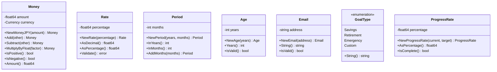

# クラス図 (Class Diagram)

このドキュメントは、財務計画計算機アプリケーションのドメインモデルとアーキテクチャ構造を可視化したクラス図です。

## Clean Architecture / DDD構造

このアプリケーションは、Clean Architecture（クリーンアーキテクチャ）とDDD（ドメイン駆動設計）の原則に基づいて設計されています。

## レイヤー構造

## ドメインモデル

### 集約（Aggregates）

### エンティティ（Entities）

### 値オブジェクト（Value Objects）

### ドメインサービス（Domain Services）

## ユースケース（Application Layer）

## リポジトリ（Repository Interfaces）

## アーキテクチャの特徴

### 依存性の方向
- 外側の層は内側の層に依存する
- 内側の層（Domain Layer）は外側の層に依存しない
- Infrastructure層はDomain層のインターフェースを実装する

### レイヤーの責務

#### Domain Layer（ドメイン層）
- ビジネスロジックの核心
- エンティティ、値オブジェクト、集約、ドメインサービス
- フレームワークやライブラリに依存しない

#### Application Layer（アプリケーション層）
- ユースケースの実装
- ドメインオブジェクトの調整
- トランザクション管理

#### Infrastructure Layer（インフラ層）
- データベースアクセス
- 外部API連携
- ファイルシステムアクセス

#### Presentation Layer（プレゼンテーション層）
- HTTPリクエスト/レスポンス処理
- 入力バリデーション
- 認証・認可

### 設計パターン

- **Repository Pattern**: データアクセスの抽象化
- **Aggregate Pattern**: 関連エンティティのグループ化
- **Value Object Pattern**: 不変な値の表現
- **Domain Service Pattern**: エンティティに属さないビジネスロジック
- **Use Case Pattern**: アプリケーション機能の明示的な表現
