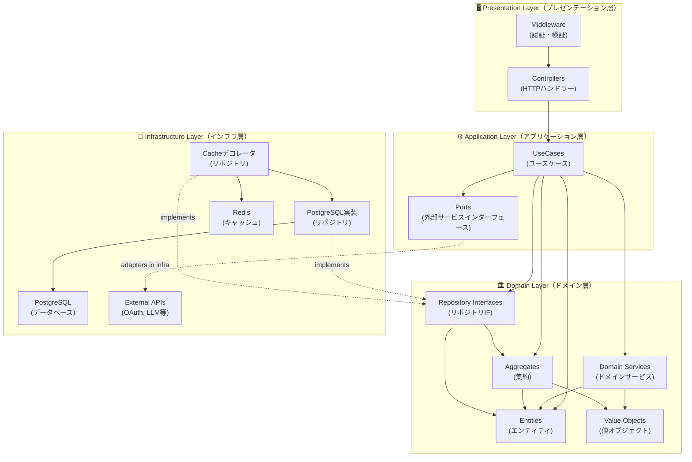
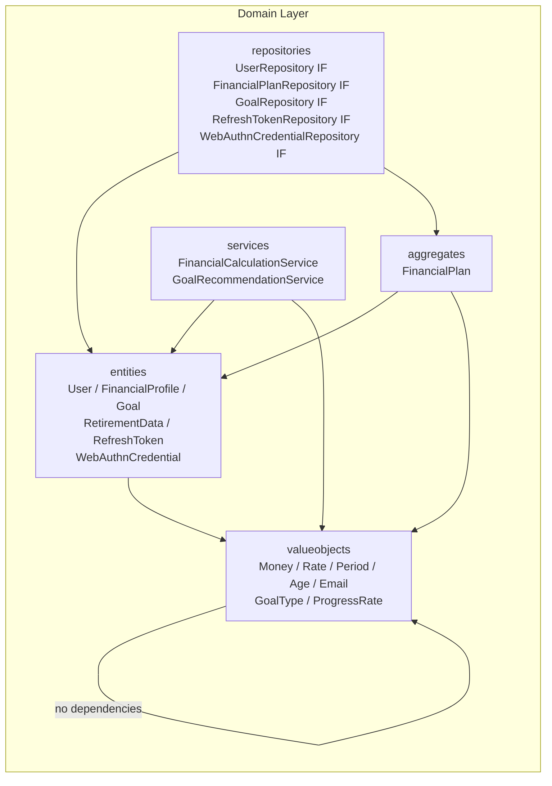
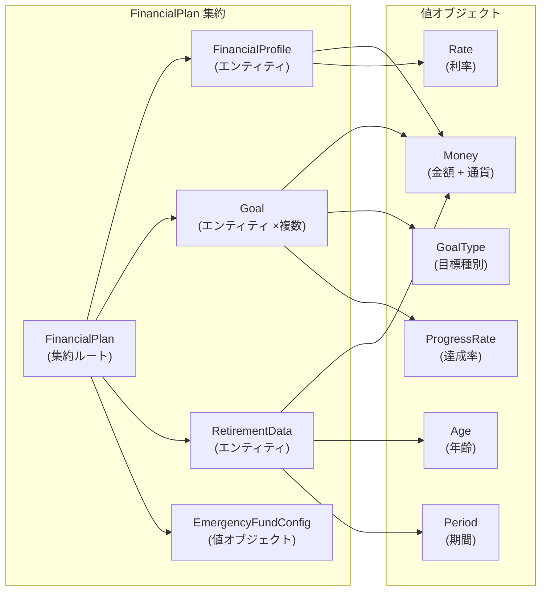
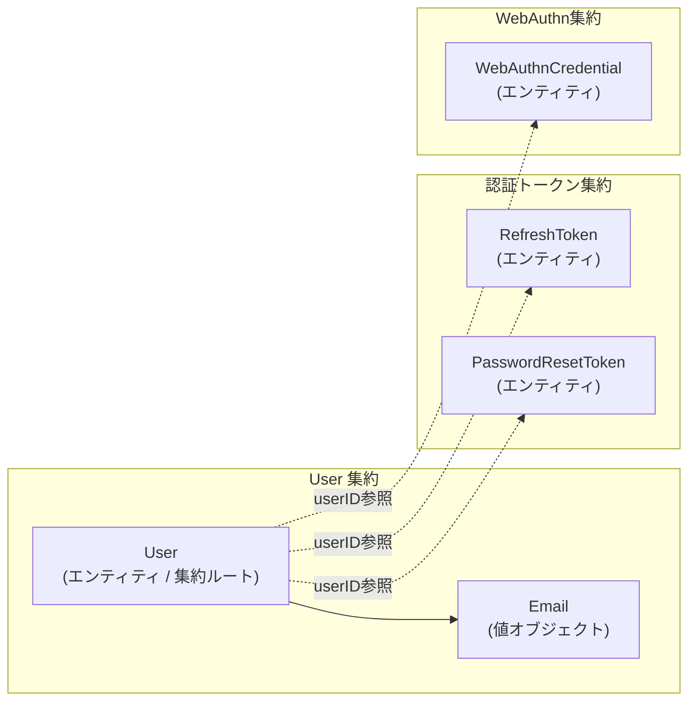
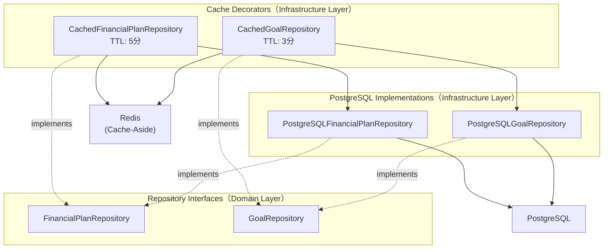
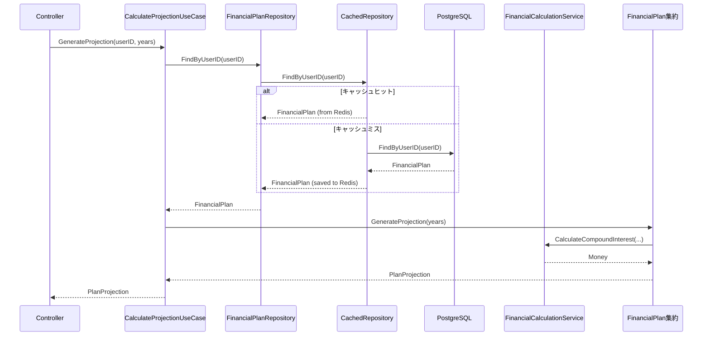

# ドメイン境界の依存関係図

このドキュメントは、バックエンドの DDD 実装におけるドメイン境界・依存関係を可視化し、各層の設計意図を明確にしたものです。

## 全体依存関係マップ

### レイヤー間の依存方向

### ドメイン層の内部依存

ドメイン層内でのサブパッケージ間の依存は一方向に保たれています。

**ルール**: 値オブジェクト → エンティティ → 集約 の順で依存し、逆方向の依存は禁止。

---

## ドメインモデルの境界

### 1. 財務計画ドメイン（Financial Planning Domain）

財務計画に関する中心的なビジネスロジックを担うドメイン。

**集約の不変条件（Invariants）**:
- `FinancialPlan.AddGoal()` は目標の達成可能性を検証してから追加する
- 目標額・期日の整合性は `Goal` エンティティ内で保証する
- 集約外からは `Goal` を直接変更できない（集約ルート経由のみ）

### 2. 認証ドメイン（Authentication Domain）

ユーザー識別・認証に関するドメイン。財務計画ドメインとは独立した集約として設計。

**境界の意図**: 認証トークン・WebAuthn資格情報は、ライフサイクルが `User` と異なる（トークンは短命、資格情報は複数保持）ため、別の集約として分離。集約間は `UserID` 参照で結合する。

---

## Application Layer のユースケース依存

各ユースケースがどのドメインオブジェクトを利用するかを示す。

```mermaid
graph TD
    subgraph AuthGroup["認証グループ"]
        AuthUC["AuthUseCase"]
        WebAuthnUC["WebAuthnUseCase"]
    end

    subgraph FinancialGroup["財務計画グループ"]
        ManageFinancialUC["ManageFinancialDataUseCase"]
        ManageGoalsUC["ManageGoalsUseCase"]
        CalcProjectionUC["CalculateProjectionUseCase"]
        GenerateReportsUC["GenerateReportsUseCase"]
    end

    subgraph BotGroup["AIボットグループ"]
        BotUC["BotUseCase"]
    end

    AuthUC --> UserRepo["UserRepository"]
    AuthUC --> RTRepo["RefreshTokenRepository"]
    WebAuthnUC --> UserRepo
    WebAuthnUC --> WACRepo["WebAuthnCredentialRepository"]

    ManageFinancialUC --> FPRepo["FinancialPlanRepository"]
    ManageGoalsUC --> GoalRepo["GoalRepository"]
    ManageGoalsUC --> FPRepo
    CalcProjectionUC --> FPRepo
    CalcProjectionUC --> CalcSvc["FinancialCalculationService"]
    GenerateReportsUC --> FPRepo

    BotUC --> LLMPort["LLMClient Port"]
    BotUC --> FAQPort["FAQLoader Port"]
```

**設計の意図**: ユースケースはドメインサービスとリポジトリインターフェースにのみ依存する。インフラ実装（PostgreSQL、Redis、外部API）には依存しない。

---

## Infrastructure Layer の実装構造

**Decorator Pattern**: `CachedXxxRepository` は `XxxRepository` インターフェースを実装しながら、内部で PostgreSQL 実装をラップする。アプリケーション層はキャッシュ有無を意識しない（→ ADR-006）。

---

## 境界を越えるデータフロー

典型的なユースケース「将来予測の計算」でのデータフロー。

---

## 境界の設計原則まとめ

| 原則 | 内容 | 実現方法 |
|---|---|---|
| **依存方向の統一** | 外側→内側のみ。内側は外側を知らない | Goのimportで強制 |
| **集約の自己完結性** | 集約の不変条件は集約ルートが保証する | `AddGoal()`等のメソッドで検証 |
| **集約間の結合はIDのみ** | 異なる集約はオブジェクト参照ではなくIDで結合 | `UserID`型で参照 |
| **インターフェース経由の抽象化** | インフラ実装をドメインから隠蔽 | Repository Interfaceパターン |
| **Ports & Adapters** | 外部サービス（LLM, FAQ）はポートで抽象化 | `application/ports/`パッケージ |
| **値オブジェクトの不変性** | `Money`、`Rate`等は変更不可 | Goの値型（structの値渡し） |

---

**関連ドキュメント:**
- [クラス図（各モデルの属性・メソッド詳細）](./CLASS_DIAGRAM.md)
- [ADR-007: DDDドメイン境界の設計方針](../adr/007-ddd-domain-boundary.md)
- [ADR-006: Redisキャッシュ戦略](../adr/006-redis-cache-strategy.md)

**最終更新日**: 2026-04-27
