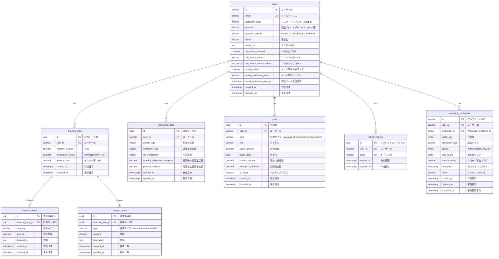

# ER図 (Entity-Relationship Diagram)

このドキュメントは、財務計画計算機アプリケーションのデータベーススキーマを可視化したER図です。

## データベース構造

## テーブル説明

### users（ユーザー）
ユーザー情報を管理するマスターテーブル。認証情報（ローカル認証、OAuth、2FA、パスキー）を含みます。

### financial_data（財務データ）
ユーザーの基本的な財務情報（月収、期待投資利回り、インフレ率）を保存します。各ユーザーに対して1レコードのみ（UNIQUE制約）。

### expense_items（支出項目）
月間支出の詳細を保存します。カテゴリ別に複数の支出項目を管理可能。

### savings_items（貯蓄項目）
現在の貯蓄・投資の詳細を保存します。預金、投資、その他の3タイプに分類。

### retirement_data（退職・年金情報）
老後計画に関する情報を保存します。各ユーザーに対して1レコードのみ（UNIQUE制約）。

### goals（目標）
ユーザーの財務目標を管理します。貯蓄、退職、緊急資金、カスタムの4タイプをサポート。

### refresh_tokens（リフレッシュトークン）
JWT認証のリフレッシュトークンを管理します。セキュアなトークン更新機構を実現。

### webauthn_credentials（WebAuthn認証情報）
パスキー（生体認証等）による認証情報を管理します。複数のデバイスに対応。

## インデックス

主要なインデックスは以下の通り：

- `users`: email, provider+provider_user_id, two_factor_enabled
- `financial_data`: user_id
- `expense_items`: financial_data_id, category
- `savings_items`: financial_data_id, type
- `retirement_data`: user_id
- `goals`: user_id, type, is_active, target_date, user_id+is_active（部分インデックス）
- `refresh_tokens`: user_id, token
- `webauthn_credentials`: user_id, credential_id

## 制約

### CHECK制約
- 金額フィールド: 負の値を許可しない（一部は正の値のみ）
- 年齢フィールド: 0-120の範囲
- パーセンテージ: 適切な範囲（投資利回り: 0-100%, インフレ率: 0-50%）
- 退職年齢 > 現在の年齢
- 平均寿命 > 退職年齢
- 目標日 > 現在日

### 外部キー制約
すべての外部キーは`ON DELETE CASCADE`を設定し、親レコード削除時に関連レコードも自動削除されます。

## トリガー

すべてのテーブルに`updated_at`列の自動更新トリガーが設定されています。レコード更新時に自動的に現在日時が設定されます。
