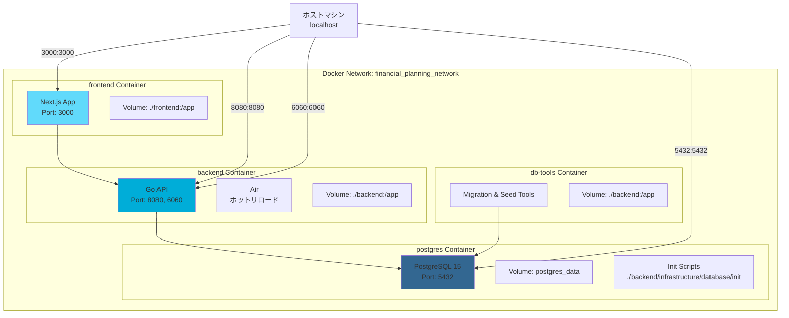
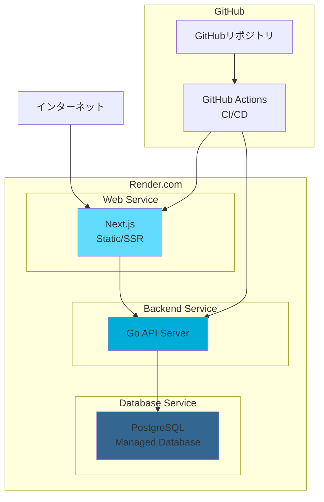
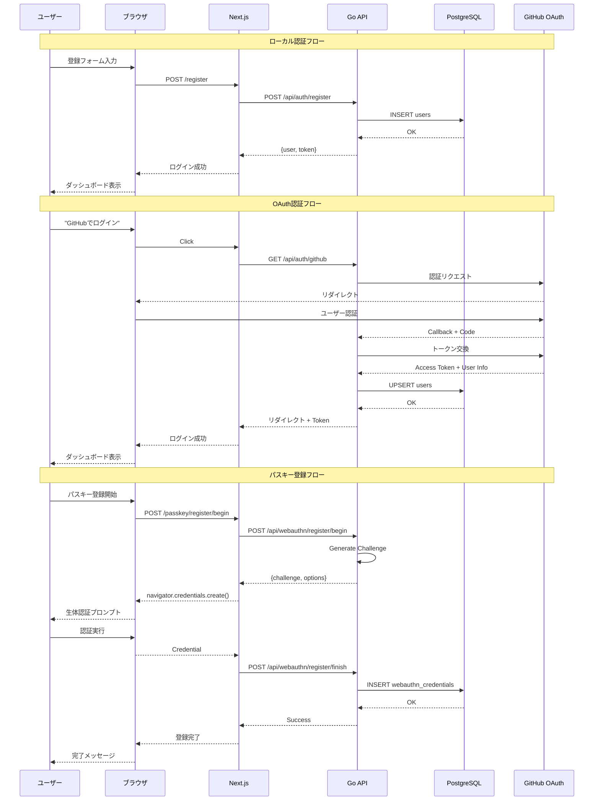
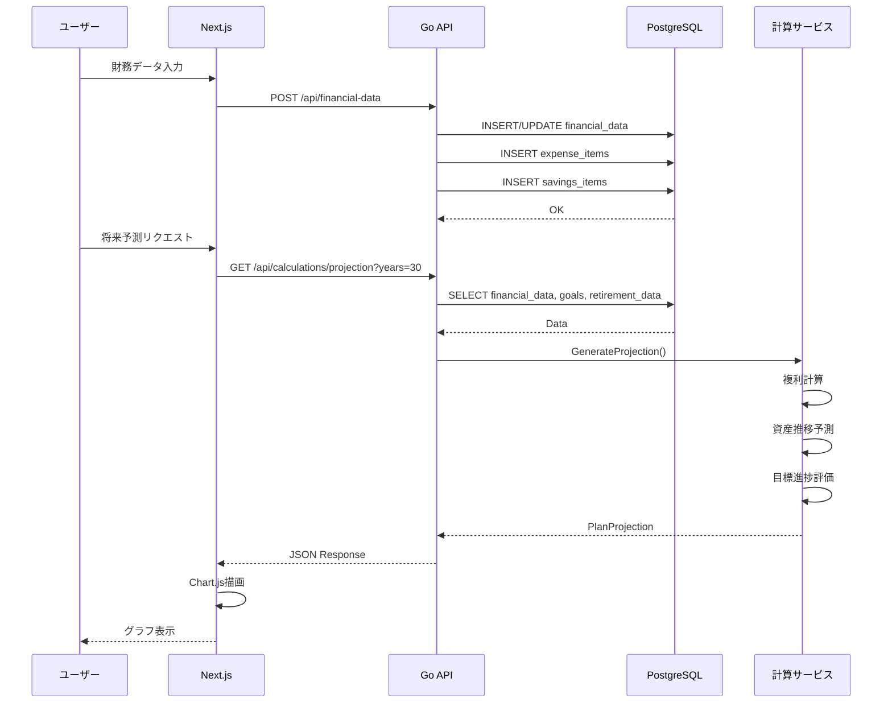
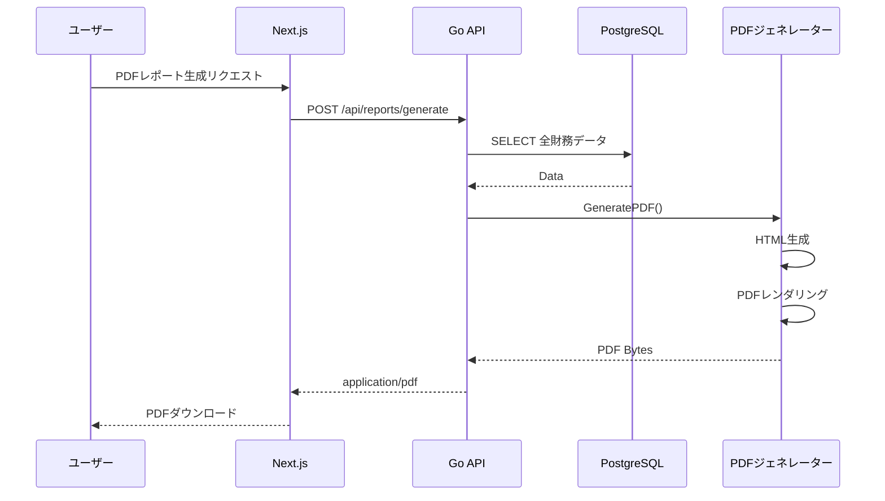
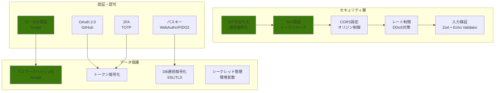

# システム構成図 (System Architecture Diagram)

このドキュメントは、財務計画計算機アプリケーションのシステム全体の構成とネットワーク構造を可視化した図です。

## システム全体構成

```mermaid
graph TB
    subgraph "クライアント"
        Browser["Webブラウザ"]
        PasskeyDevice["パスキーデバイス<br/>（生体認証等）"]
    end

    subgraph "フロントエンド層"
        NextJS["Next.js 14<br/>TypeScript<br/>Port: 3000"]
        NextJSFeatures["- App Router<br/>- React Hook Form<br/>- Chart.js<br/>- Tailwind CSS"]
    end

    subgraph "バックエンド層"
        API["Go API Server<br/>Echo Framework<br/>Port: 8080"]
        APIFeatures["- RESTful API<br/>- JWT認証<br/>- OpenAPI/Swagger<br/>- pprof（開発環境）"]
    end

    subgraph "データベース層"
        PostgreSQL["PostgreSQL 15<br/>Port: 5432"]
        DBFeatures["- UUIDエクステンション<br/>- トリガー<br/>- インデックス最適化"]
    end

    subgraph "外部サービス"
        GitHub["GitHub OAuth<br/>認証プロバイダー"]
        WebAuthn["WebAuthn/FIDO2<br/>パスキー認証"]
    end

    subgraph "開発ツール"
        Swagger["Swagger UI<br/>localhost:8080/swagger"]
        pprof["pprof<br/>localhost:6060/debug/pprof"]
    end

    Browser --> NextJS
    PasskeyDevice -.-> Browser
    NextJS --> API
    API --> PostgreSQL
    API --> GitHub
    API --> WebAuthn
    Browser --> Swagger
    Browser --> pprof

    style NextJS fill:#61dafb
    style API fill:#00add8
    style PostgreSQL fill:#336791
    style GitHub fill:#181717
    style WebAuthn fill:#3c790a
```



## Docker環境構成



## デプロイメント構成（本番環境）



## ネットワークフロー

### ユーザー登録・ログインフロー



### 財務計画計算フロー



### レポート生成フロー



## セキュリティ構成



## 技術スタック詳細

### フロントエンド
| 技術 | バージョン | 用途 |
|------|-----------|------|
| Next.js | 14 | Reactフレームワーク、App Router |
| TypeScript | 5.x | 型安全な開発 |
| Tailwind CSS | 3.x | ユーティリティファーストCSS |
| Chart.js | 4.x | データ可視化 |
| React Hook Form | 7.x | フォーム管理 |
| Zod | 3.x | スキーマ検証 |
| Axios | 1.x | HTTPクライアント |

### バックエンド
| 技術 | バージョン | 用途 |
|------|-----------|------|
| Go | 1.24.0 | プログラミング言語 |
| Echo | 4.x | Webフレームワーク |
| GORM | 1.x | ORM（検討中） |
| go-webauthn | 0.x | WebAuthn実装 |
| jwt-go | 5.x | JWT認証 |
| bcrypt | - | パスワードハッシュ化 |
| golang-migrate | 4.x | DBマイグレーション |
| swaggo | 1.x | OpenAPI/Swagger生成 |
| pprof | - | パフォーマンスプロファイリング |

### データベース
| 技術 | バージョン | 用途 |
|------|-----------|------|
| PostgreSQL | 15 | リレーショナルデータベース |
| uuid-ossp | - | UUID生成エクステンション |

### 開発ツール
| 技術 | バージョン | 用途 |
|------|-----------|------|
| Docker | - | コンテナ化 |
| Docker Compose | - | マルチコンテナ管理 |
| Air | - | Goホットリロード |
| golangci-lint | 1.64+ | Goリンター |
| ESLint | - | JavaScriptリンター |
| Prettier | - | コードフォーマッター |

## ポート一覧

| サービス | ポート | 説明 |
|---------|-------|------|
| フロントエンド | 3000 | Next.js開発サーバー |
| バックエンドAPI | 8080 | Go Echo サーバー |
| pprof | 6060 | パフォーマンスプロファイリング（開発環境のみ） |
| PostgreSQL | 5432 | データベース |
| Swagger UI | 8080/swagger | API仕様書UI |

## 環境変数

### バックエンド
```bash
# データベース
DB_HOST=postgres
DB_PORT=5432
DB_USER=postgres
DB_PASSWORD=password
DB_NAME=financial_planning
DB_SSLMODE=disable

# JWT
JWT_SECRET=your-secret-key
JWT_EXPIRATION=24h

# OAuth
GITHUB_CLIENT_ID=your-github-client-id
GITHUB_CLIENT_SECRET=your-github-client-secret
GITHUB_CALLBACK_URL=http://localhost:8080/api/auth/github/callback

# アプリケーション
GIN_MODE=debug  # 注: 現在は使用されていない（レガシー設定）
ENABLE_PPROF=true
PPROF_PORT=6060
```

### フロントエンド
```bash
NEXT_PUBLIC_API_URL=http://localhost:8080
WATCHPACK_POLLING=true
```

## ヘルスチェック

### バックエンド
- **エンドポイント**: `GET /health`
- **間隔**: 30秒
- **タイムアウト**: 10秒
- **再試行**: 3回

### PostgreSQL
- **コマンド**: `pg_isready -U postgres -d financial_planning`
- **間隔**: 10秒
- **タイムアウト**: 5秒
- **再試行**: 5回

## スケーリング戦略

### 水平スケーリング
- フロントエンド: Render.comの自動スケーリング
- バックエンド: 複数インスタンスへの負荷分散
- データベース: リードレプリカの追加（将来）

### 垂直スケーリング
- より大きなコンテナサイズへの移行
- データベースリソースの増強

## 監視とロギング

### ログ
- アプリケーションログ: stdout/stderr
- アクセスログ: Echo middleware
- エラーログ: 構造化ログ（JSON）

### メトリクス（将来実装予定）
- pprof: パフォーマンスメトリクス
- Prometheus: メトリクス収集
- Grafana: 可視化

## バックアップ戦略

### データベース
- 自動バックアップ: 日次
- ポイントインタイムリカバリ: 7日間
- スナップショット: 手動実行可能

### アプリケーション
- GitHubリポジトリ: ソースコードのバックアップ
- 環境変数: セキュアな管理（Render.com）
